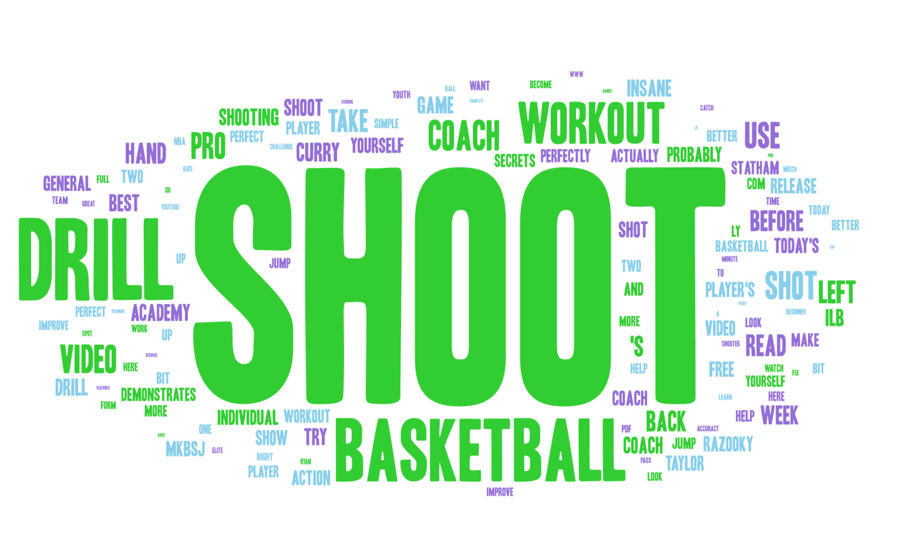

# Lab 2: YouTube Web Data Collection and Word Cloud Comparison

## Topic and main takeaway
My main takeaway from this Lab 2 exercise is that web data collection is not just about scraping a page and saving a spreadsheet. It is about how platform language shapes what we notice. By collecting YouTube search results and turning the text into word clouds, I could see how basketball training is not one single topic on YouTube. It breaks into different skill cultures with different vocabularies. Even though both searches are about improving as a player, the words people use to describe improvement are not the same.

## Search parameters
To keep the theme consistent, I stayed within basketball skill development and used two search queries that are closely related but still different in what they focus on:

- Search 1: `basketball shooting workout`  
  URL format: `https://www.youtube.com/results?search_query=basketball+shooting+workout`

- Search 2: `ball handling workout`  
  URL format: `https://www.youtube.com/results?search_query=ball+handling+workout`

For each search, I ran the YouTube crawler to load results, scroll to retrieve more videos, and extract basic metadata and short descriptions. Before generating the word clouds, I removed obvious filler text (links, subscribe, repeated promo phrases, and broken characters) so the clouds would reflect the actual training language instead of platform noise.

## Why I wanted to make this comparison
I wanted to compare shooting and ball handling because they are two core skills that I train constantly, but they are taught in different ways. Shooting is usually framed around outcomes (making shots, form, reps), while ball handling is often framed around control (movement, rhythm, protecting the ball). I expected the two searches to overlap, but I also expected each to have its own signature words that reveal what creators emphasize.

## Word clouds (results)

### Word Cloud 1: Shooting-focused search

The shooting cloud is dominated by SHOOT, along with big supporting terms like WORKOUT, DRILL, BASKETBALL, and COACH. What this suggests to me is that shooting content is marketed as structured training sessions: drills, workouts, and coaching. Even without watching the videos, the language makes it feel like the main promise is direct performance improvement and better shooting through repetition and instruction.

### Word Cloud 2: Ball-handling-focused search

The ball-handling cloud is dominated by HANDLE and BALL, with strong supporting words like DRIBBLE, CONTROL, RHYTHM, COORDINATION, DEFENSE, and MOVEMENT. This one feels more mechanical and process-based. Instead of focusing on a single end result, the language points to how the skill works: staying low, controlling the ball, moving through cones, handling pressure, and building coordination.

## Similarities and differences
The big similarity is that both clouds are built around the same training framing: WORKOUT and DRILL show up strongly in both. That tells me YouTube basketball skill content tends to be packaged as routines you can repeat and follow along with, not just explanations.

The main difference is the center of gravity. The shooting cloud is dominated by outcome language (SHOOT) and general training structure, while the ball-handling cloud is dominated by control language (HANDLE, DRIBBLE, CONTROL, RHYTHM). The ball-handling results also contain more words that imply reacting to defenders and game situations, which makes sense because handling is closely tied to pressure and movement.

## Possible reasons for the patterns
One reason these patterns show up is that shooting is easier to describe as a clear goal, make more shots, improve form so shoot becomes the anchor word. Ball handling is harder to describe as one single endpoint, so creators lean on vocabulary about mechanics and feel: rhythm, coordination, control, and movement. Another factor is platform culture. YouTube training videos often use repeated workout and drill language because it performs well for search and makes content feel actionable.

## What stood out compared to what I expected
I expected the two clouds to look almost the same since they are both basketball workouts. What stood out is how different the skill identity is. The shooting cloud feels like it is selling a direct performance outcome. The handling cloud feels like it is selling control, movement, and the ability to deal with defense. That difference came through clearly just from the words, which surprised me because I did not think a word cloud would separate the two topics that cleanly.

## How this research could be improved
If I did this again, I would:
- Collect a larger sample by scrolling more or running the crawler more times per query.
- Add a third related query (for example shooting form drill or ball handling drills at home) to test whether the same patterns hold.
- Improve text cleaning by removing more generic YouTube phrasing (like today, use, watch, free) so the clouds represent basketball concepts even more strongly.
- Segment results into categories (trainer channels vs NBA highlight channels) to see if vocabulary shifts depending on content type.

## Download the datasets (CSV)
- Result 1 (CSV): https://drive.google.com/file/d/1gZnvWEIR-UosaQ6_Qy718DLk5XNNAPt6/view?usp=sharing  
- Result 2 (CSV): https://drive.google.com/file/d/1qYHFzO0bD9Lf2NjLsw4IVaP6fEY9dMVT/view?usp=sharing
